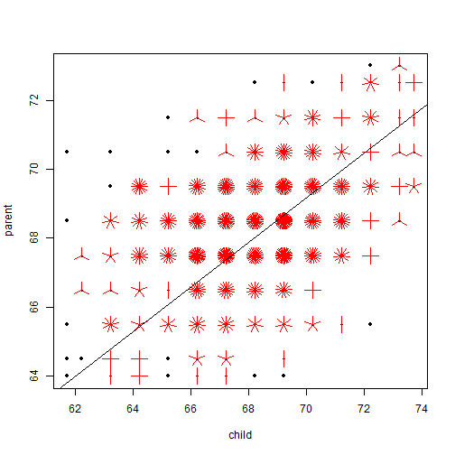

Developing Data Products Course Project
========================================================
Child Height Predictor
---------
Gabriela Barrios 

Objectives
========================================================

The purpose of this app is to predict the child height given the parents height and the child gender.

The app is based on the Galton data.

Model fit and prediction
========================================================

 

Data
========================================================

The ui.R was written to make a simple interface for parent height entry & server.R included the model fit and prediction function.

The output contains the predicted child height and the 95% confidence interval.

Shiny app URL:  https://gabybs.shinyapps.io/Developing-Data-Products-CP

Instructions
========================================================

To use this app you need to:

1. Enter the parents heights 
2. Choose the child's gender
3. Click the Calculate button 

And you will get the result.
